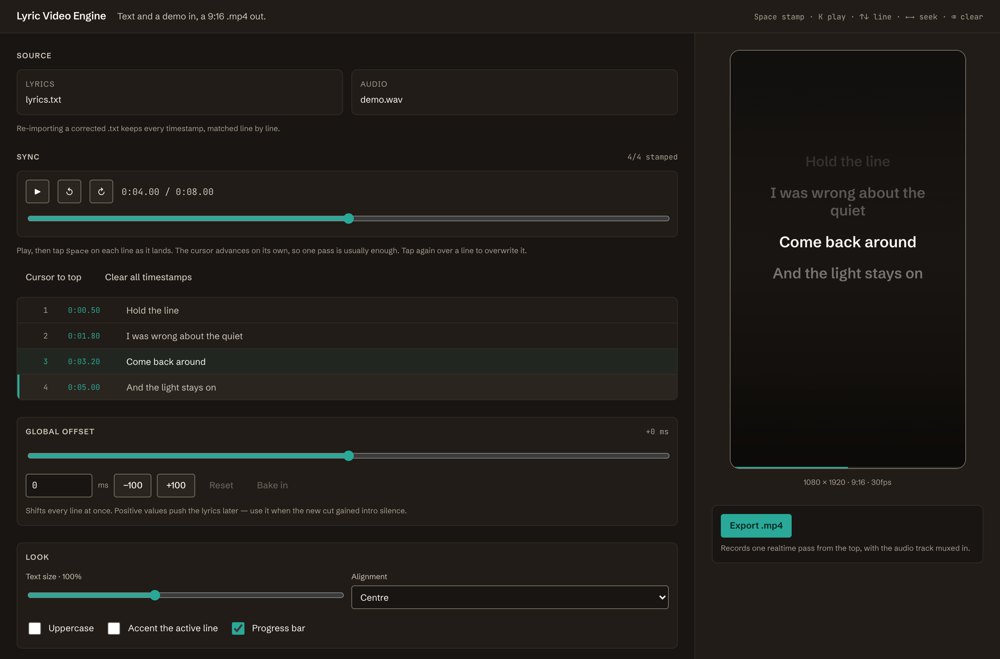

# Lyric Video Engine

Turn a lyric `.txt` and a demo `.wav` into a 9:16 vertical lyric video, exported
as an `.mp4` ready for social. Tokenising, syncing, rendering and encoding all
happen in the browser. Nothing is uploaded.



## Run it

```bash
npm install
npm run dev
```

Then open http://localhost:5173.

```bash
npm test          # reducer, helper and contrast tests
npm run test:e2e  # export routes and keyboard sync, in a real browser
npm run lint      # oxlint
npm run build     # static bundle in dist/
npm run preview   # serve that bundle
```

No environment variables, no services to start. The build is static — any host
that serves `dist/` will do, as long as it sends `.wasm` as `application/wasm`.

## Using it

Drop in the lyrics and the demo. Press <kbd>K</kbd> to play, then tap
<kbd>Space</kbd> as each line lands — the cursor advances on its own, so one
playthrough is usually enough. Tap again over a line to overwrite it.

Two things make the second pass unnecessary:

**Fix a typo, keep the timing.** Timestamps live on the line object, not on the
text. Editing a line — or re-importing a corrected `.txt` — leaves every
timestamp where it was.

**New cut, one number.** The global offset shifts every line at once, applied
when the video is drawn rather than written into the lines. A demo that gained
1.2s of intro silence is one slider away, and the original sync pass stays
intact underneath. "Bake in" folds the shift into the stored timestamps once
you're happy with it.

### Keyboard

| Key | Action |
|---|---|
| <kbd>Space</kbd> | Stamp the cursor line at the playhead, then advance |
| <kbd>K</kbd> | Play / pause |
| <kbd>↑</kbd> <kbd>↓</kbd> | Move the cursor |
| <kbd>←</kbd> <kbd>→</kbd> | Seek 2s (hold <kbd>Shift</kbd> for 10s) |
| <kbd>Enter</kbd> | Seek to the cursor line's timestamp |
| <kbd>⌫</kbd> | Clear the cursor line's timestamp |

Space is the tap key rather than play/pause, because it's the one pressed
hundreds of times in a session. Every shortcut stands down while a text field
has focus, so typing a lyric with spaces in it can't stamp anything.

## How it works

**One clock.** `audio.currentTime` is the only source of truth. A single
`requestAnimationFrame` loop reads it and pushes the value to whoever needs it —
the canvas, the transport readout, the active-line highlight. Nothing keeps a
parallel timer, so nothing can drift, and per-frame updates never pass through
React state.

**Timestamps decoupled from text.** Lines are `{ id, text, time }`. Text actions
address a line by `id` and write `text` only; timestamps are written by four
actions and no others. That separation is the whole product, so it's the part
covered by tests.

**The canvas.** 1080×1920, drawn every frame. Text wrapping is measured once per
text or style change, never per frame, and the whole stack animates off one
eased scroll value — a line's opacity and scale fall out of its distance from
the focal point.

**Export.** The canvas being recorded is the canvas you're watching, driven by
the same clock, so what downloads is what you approved. The route depends on
what the browser will record:

| Route | Recorded as | Then |
|---|---|---|
| direct | MP4 | Downloaded as-is |
| remux | H.264 in WebM | ffmpeg copies the video stream into MP4 — seconds |
| transcode | VP8/VP9 | Full H.264 re-encode — minutes, and labelled before it starts |

ffmpeg.wasm is imported lazily and served from the app's own bundle, so the
initial load is ~77kB gzipped, the 32MB core is only fetched when a conversion
is actually needed, and an export still works offline.

## Structure

```txt
src/
  components/   presentational; no timing or file logic
  hooks/        browser APIs — audio engine, shortcuts, export
  lib/          pure or DOM-only helpers, no React
  state/        the project reducer and its selectors
  styles/       tokens.css and global.css
tests/          node --test over src/lib and src/state
```

`lib/` and `state/` stay importable without React, which is what keeps them
testable under plain `node --test`. Anything that runs per frame lives in `lib/`
or a ref — never in React state.

## Worth knowing

- **Export runs in realtime.** A four-minute song takes four minutes. Recording
  the live canvas is what guarantees the export matches the preview; the faster
  alternatives are weighed in `decisions/0001`.
- **Switching tabs pauses the export** rather than corrupting it.
  `requestAnimationFrame` throttles in a hidden tab, which would otherwise
  freeze the frames while the audio kept going, so the recorder and the clock
  both stop until you come back.
- **Blank lines are stanza separators** and are dropped, so a chorus currently
  reads continuous with the verse before it. Open question in the spec.
- **Re-import matches by position.** Reordering lines between demo versions
  loses the carry-over; correcting them doesn't.
- Chrome and Safari 17+ record MP4 directly. Firefox goes through conversion.

## Where the decisions live

- [`specs/2026-09-19-lyric-video-mvp.md`](specs/2026-09-19-lyric-video-mvp.md) — what the product does, and what it deliberately doesn't
- [`decisions/0001-realtime-canvas-recording-for-export.md`](decisions/0001-realtime-canvas-recording-for-export.md) — why export works this way
- [`docs/architecture.md`](docs/architecture.md) — the technical rules that hold across the app
- [`docs/backlog.md`](docs/backlog.md) — what's open right now
- [`AGENTS.md`](AGENTS.md) — entry point for coding agents

This project was started from the AI Product Starter Kit, which is where
`docs/`, `skills/`, `guide/` and `START-HERE.md` come from.
